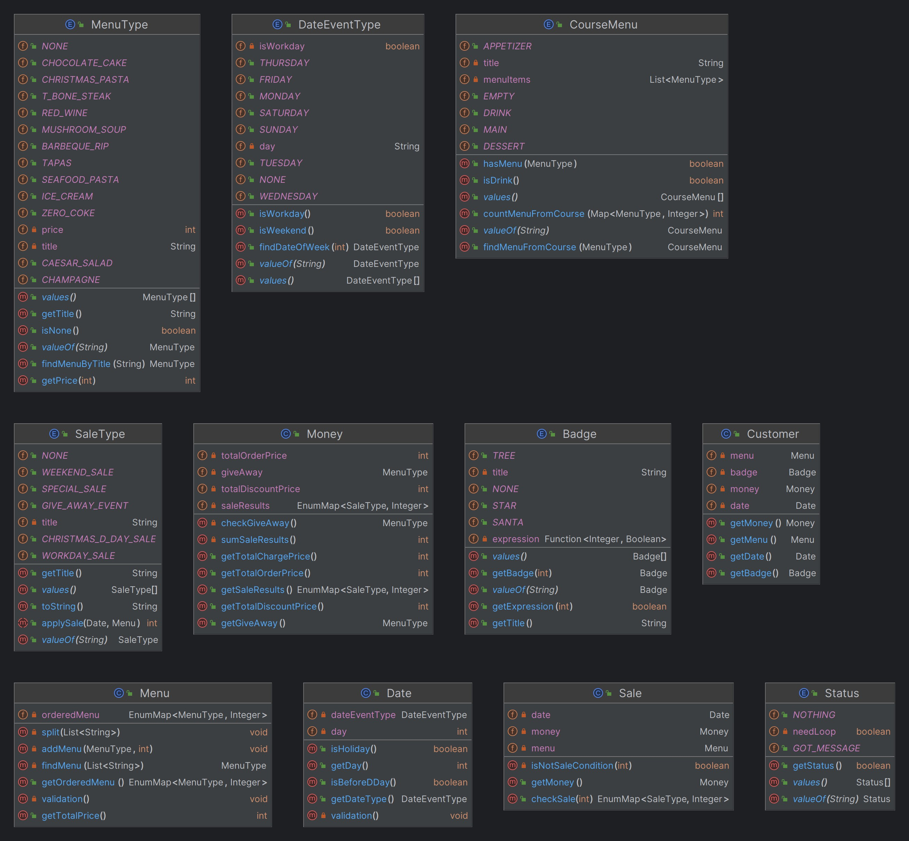

## 🎄 크리스마스 프로모션 이벤트 구현 요소

***

### [입력 관련]

#### 예약 날짜를 물어본다

- [x] 1이상 31이하 숫자만 받는다.
- [x] 숫자가 아닌 경우 IllegalArgumentException
- [x] 모든 예외 처리는 다시 값을 받는다.

#### 주문할 메뉴와 메뉴 갯수를 물어본다.

- [x] 메뉴판에 없는 메뉴를 받으면 IllegalArgumentException
- [x] 중복 메뉴를 입력한 경우 IllegalArgumentException
- [x] 메뉴-갯수, 형태로 받는다.
    - [x] 메뉴 개수 1 이상의 숫자가 아니면 IllegalArgumentException
    - [x] 입력 형태가 옳지 않으면 IllegalArgumentException
    - [x] 메뉴가 20개 이상이면 IllegalArgumentException
- [x] 모든 예외 처리는 다시 값을 받는다.

***

### [프로모션 관련]

- [x] 메뉴를 주문한다
    - [x] 총 주문 금액이 만원 이상인지 확인한다.
    - [x] 음료만 주문했는지 확인한다.
- [x] 할인 목록을 체크한다.
    - [x] 평일/주말 할인, 크리스마스 디데이 할인, 특별 할인, 증정이벤트 순으로 체크
- [x] 혜택 이벤트 뱃지 수령 가능 여부를 체크한다.
    - [x] 없음, 5000원 이상 별, 1만원 이상 트리, 2만원 이상 산타

#### 할인 관련

- 메뉴판

```
<애피타이저>
양송이수프(6,000), 타파스(5,500), 시저샐러드(8,000)

<메인>
티본스테이크(55,000), 바비큐립(54,000), 해산물파스타(35,000), 크리스마스파스타(25,000)

<디저트>
초코케이크(15,000), 아이스크림(5,000)

<음료>
제로콜라(3,000), 레드와인(60,000), 샴페인(25,000)
```

- 크리스마스 디데이 할인 12/1 ~ 12/25
    - [x] 12월 1일 1000원 할인 이후로 1일 지날 때 마다 100원씩 할인
    - [x] 총 주문 금액에서 할인됨

- 평일 할인 - 12/1 ~ 12/31
    - [x] 일 ~ 목요일 디저트 메뉴당 2023원 할인

- 주말 할인 - 12/1 ~ 12/31
    - [x] 금,토 메인 메뉴당 2023원 할인

- 특별 할인 - 12/1 ~ 12/31
    - [x] 달력에 별이 있으면 총 주문 금액에서 1000원 할인

- 증정이벤트 - 12/1 ~ 12/31
    - [x] **_할인 전_** 총 주문 금액이 12만원 이상이면 삼페인 1개 증정
    - [x] 없는 경우 없음으로 표기

#### [혜택 관련]

- 총혜택 금액 = 할인 금액의 합계 + 증정 메뉴의 가격
    - [x] 5천 원 이상: 별
    - [x] 1만 원 이상: 트리
    - [x] 2만 원 이상: 산타

***

### [출력 관련]

- [x] 할인 전 총 주문 금액 출력
- [x] 증정 메뉴 출력
- [x] 혜택 내역 출력
- [x] 총 혜택 내역 출력
- [x] 할인 후 예상 결제 금액 출력
- [x] 이벤트 뱃지 출력

## ✅ 체크할 로직 목록

- [x] enum을 통해 금요일부터 %7해서 요일 관리를 해야할까?
- [x] 인풋 받을 때 stage별 enum으로 관리를 하는게 좋을까? while문 사용 안 할 수 있을까?
- [x] 메뉴판도 enum으로 관리하는게 좋지 않을까?

## 모델 디자인

https://drive.google.com/file/d/1qUlpbLRLXFrBHCGPmx2wMVT6Cff4OgeV/view?usp=sharing


## 모델 결과


